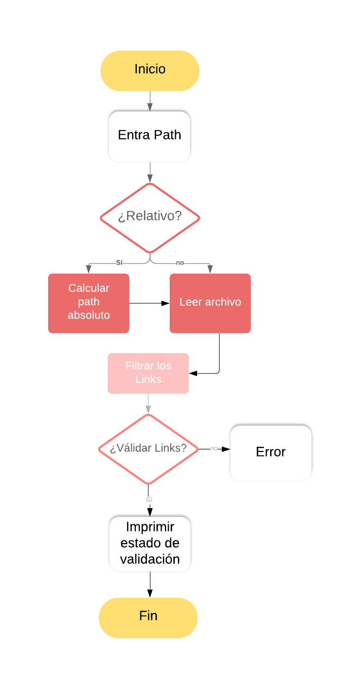
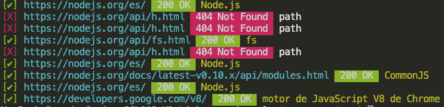

# Markdown-Links
¿Que es Markdown-links? Es una libreria que puede ser utilizada para extraer links de archivos Markdown, hace la válidación del estado de los enlaces encontrados lo cuál permite conocer si un enlace existe o si esta roto.

# Diagrama de flujo 


# Modo de Uso
## 1. Para instalar está librería tienes que tener instalado Node.js en tu computador.
## 2. Para ejecutarla tendrás que ejecutar el siguiente comando el la terminal de tu archivo
`npm i md-links-CorinaVaras`
## 3. Para hacer uso de la librería escribe el siguiente comando
`node mdlinks tuarchivo.md`

## ¿Cómo se verán tus resultados en consola?
Realizará una válidación de todos los enlaces que se encuentren en tu archivo .md y te devolverá su estatus, si están ok, o si están rotos.
***



En próximas iteraciones se espera agregar las opciones de --validate y --stats para entregar estadísticas básicas sobre los links encontrados.
`Ejemplo:`
```
Total: 4
Unique: 3
Broken: 1
```


